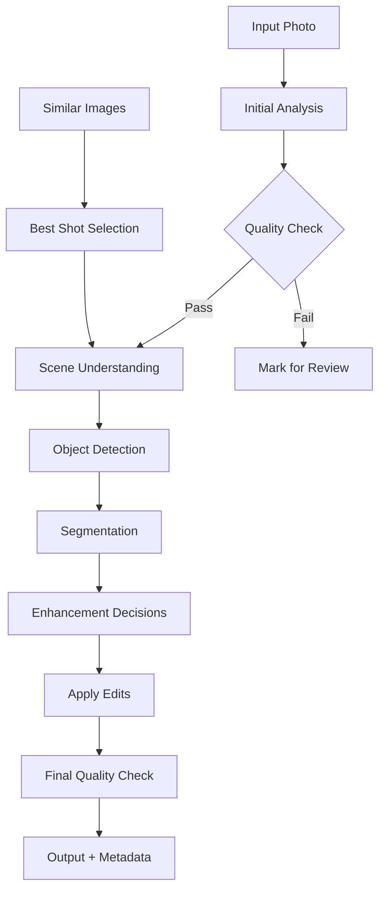

# AI Module Orchestration Workflow

## Conceptual Overview

The AI modules work together in a sophisticated pipeline where each model's output can influence subsequent processing steps. The workflow is fully parameterized through recipes, allowing users to create custom processing chains.

## Core AI Modules & Their Roles

1. **Qwen2.5-VL** - Scene Understanding & Direction
   - Provides high-level scene analysis
   - Generates processing instructions
   - Identifies key elements and composition

2. **RT-DETR** - Object Detection
   - Locates specific objects in the image
   - Provides bounding boxes for cropping/focus
   - Counts and classifies subjects

3. **SAM2** - Precise Segmentation
   - Creates masks for detected objects
   - Enables background removal/blur
   - Supports selective editing

4. **SigLIP** - Similarity & Clustering
   - Finds similar images (near-duplicates)
   - Enables style matching
   - Semantic search capabilities

5. **NIMA** - Quality Assessment
   - Scores technical quality
   - Rates aesthetic appeal
   - Filters/ranks images

## Workflow Architecture



## Detailed Workflow Stages

### Stage 1: Initial Assessment
```python
# Recipe Parameters
{
    "stage": "initial_assessment",
    "steps": [
        {
            "model": "nima",
            "action": "quality_check",
            "parameters": {
                "technical_threshold": 6.0,
                "aesthetic_threshold": 5.0,
                "reject_if_below": true
            }
        },
        {
            "model": "siglip",
            "action": "find_duplicates",
            "parameters": {
                "similarity_threshold": 0.95,
                "time_window_seconds": 30,
                "keep_best_only": true
            }
        }
    ]
}
```

### Stage 2: Scene Analysis
```python
{
    "stage": "scene_analysis",
    "steps": [
        {
            "model": "qwen2.5-vl",
            "action": "analyze_scene",
            "parameters": {
                "prompt_template": "Analyze this ${photo_type} photo. Identify: 1) Main subjects and their positions 2) Lighting conditions 3) Composition issues 4) Suggested improvements for ${style_preference}",
                "variables": {
                    "photo_type": "from_metadata",
                    "style_preference": "user_defined"
                },
                "temperature": 0.7,
                "extract_fields": ["subjects", "lighting", "composition", "suggestions"]
            }
        }
    ]
}
```

### Stage 3: Object Processing
```python
{
    "stage": "object_processing",
    "steps": [
        {
            "model": "rt-detr",
            "action": "detect_objects",
            "parameters": {
                "classes": ["person", "face", "pet", "car"],
                "confidence_threshold": 0.6,
                "max_detections": 10
            },
            "output_to": "detected_objects"
        },
        {
            "model": "sam2",
            "action": "segment_objects",
            "parameters": {
                "input_from": "detected_objects",
                "quality": "high",
                "mask_type": "binary",
                "refine_edges": true
            },
            "conditional": {
                "if": "detected_objects.count > 0",
                "else": "skip"
            }
        }
    ]
}
```

### Stage 4: Enhancement Decisions
```python
{
    "stage": "enhancement",
    "steps": [
        {
            "model": "qwen2.5-vl",
            "action": "suggest_edits",
            "parameters": {
                "prompt_template": "Based on the detected ${object_count} objects and ${scene_type} scene, suggest: 1) Optimal crop for ${aspect_ratio} 2) Color adjustments 3) Which objects to emphasize",
                "context_from": ["scene_analysis", "detected_objects"],
                "output_format": "structured"
            }
        }
    ]
}
```

### Stage 5: Smart Actions
```python
{
    "stage": "smart_actions",
    "conditional_flows": [
        {
            "condition": "detected_objects.faces.count > 5",
            "action": "group_photo_optimization",
            "steps": [
                {
                    "model": "sam2",
                    "action": "segment_all_faces",
                    "enhance": "sharpness"
                }
            ]
        },
        {
            "condition": "scene_analysis.lighting == 'low_light'",
            "action": "low_light_enhancement",
            "steps": [
                {
                    "model": "nima",
                    "action": "quality_guided_enhancement",
                    "iterate_until": "technical_score > 7.0"
                }
            ]
        },
        {
            "condition": "similar_images.count > 1",
            "action": "best_shot_selection",
            "steps": [
                {
                    "model": "nima",
                    "action": "rank_all",
                    "model": "qwen2.5-vl",
                    "action": "compare_moments",
                    "select": "highest_combined_score"
                }
            ]
        }
    ]
}
```

## Recipe Schema Design

```json
{
    "recipe": {
        "name": "Sports Action Photography",
        "version": "1.0",
        "description": "Optimized for fast-moving sports with multiple subjects",
        "stages": [
            {
                "name": "quality_filter",
                "parallel": true,
                "steps": [...],
                "continue_on_failure": false
            },
            {
                "name": "scene_analysis",
                "depends_on": ["quality_filter"],
                "steps": [...],
                "timeout_seconds": 30
            }
        ],
        "global_parameters": {
            "gpu_memory_limit": "6GB",
            "batch_size": 4,
            "cache_models": ["rt-detr", "sam2"]
        }
    }
}
```

## Orchestration Architecture

### 1. Model Manager Service
```python
class ModelManager:
    """Manages AI model lifecycle and resource allocation"""
    
    def __init__(self):
        self.loaded_models = {}
        self.gpu_memory_tracker = GPUMemoryTracker()
        self.model_cache = ModelCache()
    
    async def get_model(self, model_name: str, parameters: dict):
        """Load or retrieve cached model"""
        if model_name in self.loaded_models:
            return self.loaded_models[model_name]
        
        # Check GPU memory before loading
        required_memory = self.get_model_requirements(model_name)
        if not self.gpu_memory_tracker.can_allocate(required_memory):
            await self.free_memory(required_memory)
        
        model = await self.load_model(model_name, parameters)
        self.loaded_models[model_name] = model
        return model
```

### 2. Workflow Orchestrator
```python
class WorkflowOrchestrator:
    """Executes recipe stages with proper dependency management"""
    
    def __init__(self, model_manager: ModelManager):
        self.model_manager = model_manager
        self.celery_app = Celery('photo_processor')
        
    async def execute_recipe(self, photo: Photo, recipe: Recipe):
        context = WorkflowContext(photo=photo)
        
        for stage in recipe.stages:
            if stage.parallel:
                tasks = [self.execute_step.s(step, context) 
                        for step in stage.steps]
                group(tasks).apply_async()
            else:
                for step in stage.steps:
                    result = await self.execute_step(step, context)
                    context.add_result(step.name, result)
                    
                    if step.conditional:
                        if not self.evaluate_condition(step.conditional, context):
                            continue
```

### 3. Celery Task Structure
```python
@celery_app.task(bind=True, max_retries=3)
def process_with_model(self, model_name: str, image_path: str, parameters: dict):
    """Celery task for model inference"""
    try:
        model = load_model_cached(model_name)
        result = model.process(image_path, **parameters)
        return {
            'success': True,
            'result': result,
            'model': model_name,
            'processing_time': result.get('processing_time', 0)
        }
    except Exception as e:
        self.retry(exc=e, countdown=60)

# Task routing for different model types
celery_app.conf.task_routes = {
    'tasks.process_with_model': {'queue': 'gpu_queue'},
    'tasks.quality_check': {'queue': 'fast_queue'},
    'tasks.similarity_search': {'queue': 'cpu_queue'}
}
```

### 4. Result Aggregation
```python
class ResultAggregator:
    """Combines outputs from multiple AI models"""
    
    def aggregate_for_decision(self, results: Dict[str, Any]) -> ProcessingDecision:
        # Combine insights from all models
        scene_info = results.get('qwen25vl', {})
        objects = results.get('rtdetr', {}).get('detections', [])
        quality = results.get('nima', {})
        
        decision = ProcessingDecision()
        
        # Smart crop based on detected objects and scene analysis
        if objects and scene_info.get('composition'):
            decision.crop = self.calculate_smart_crop(objects, scene_info)
        
        # Enhancement based on quality scores
        if quality.get('technical_score', 0) < 7:
            decision.enhance = self.determine_enhancements(quality, scene_info)
        
        return decision
```

## Use Case Examples

### 1. Event Photography Workflow
```python
recipe = {
    "name": "Wedding Photography",
    "stages": [
        # Find best shots from burst sequences
        {
            "model": "siglip",
            "action": "group_similar",
            "time_window": 5
        },
        {
            "model": "nima",
            "action": "select_best_from_group"
        },
        # Enhance selected photos
        {
            "model": "rt-detr",
            "detect": ["person", "face"],
            "min_confidence": 0.8
        },
        {
            "model": "qwen2.5-vl",
            "prompt": "Identify the bride, groom, and key moments"
        },
        {
            "model": "sam2",
            "action": "enhance_faces",
            "input_from": "detected_faces"
        }
    ]
}
```

### 2. Nature Photography Workflow
```python
recipe = {
    "name": "Wildlife Photography",
    "stages": [
        {
            "model": "rt-detr",
            "detect": ["bird", "animal"],
            "early_exit_if_none": true
        },
        {
            "model": "sam2",
            "action": "isolate_subject",
            "blur_background": true
        },
        {
            "model": "nima",
            "action": "composition_check",
            "suggest_crop": true
        }
    ]
}
```

### 3. Real Estate Photography
```python
recipe = {
    "name": "Property Listing",
    "stages": [
        {
            "model": "qwen2.5-vl",
            "prompt": "Describe room type, features, and lighting",
            "extract": ["room_type", "features", "issues"]
        },
        {
            "model": "rt-detr",
            "detect": ["furniture", "window", "door"],
            "use_for": "auto_straighten"
        },
        {
            "model": "nima",
            "action": "quality_filter",
            "technical_min": 7.5
        }
    ]
}
```

## Performance Optimization

### 1. Model Pooling
- Pre-load frequently used models
- Share models across workers
- Implement LRU cache for model eviction

### 2. Batch Processing
- Group similar operations
- Process multiple images per inference
- Optimize GPU utilization

### 3. Pipeline Optimization
- Skip unnecessary steps based on early results
- Parallel execution where possible
- Result caching for repeated operations

## Next Implementation Steps

1. **Create Orchestrator Service**
   - Implement recipe parser
   - Build execution engine
   - Add progress tracking

2. **Implement Celery Workers**
   - GPU worker pool
   - CPU worker pool
   - Task routing logic

3. **Build Result Aggregator**
   - Combine model outputs
   - Generate editing decisions
   - Create metadata

4. **Recipe Builder UI**
   - Drag-drop workflow designer
   - Parameter configuration
   - Template library

---

This orchestration design allows for infinite flexibility while maintaining performance and reliability. Users can create simple recipes with just quality filtering or complex multi-stage workflows with conditional logic.